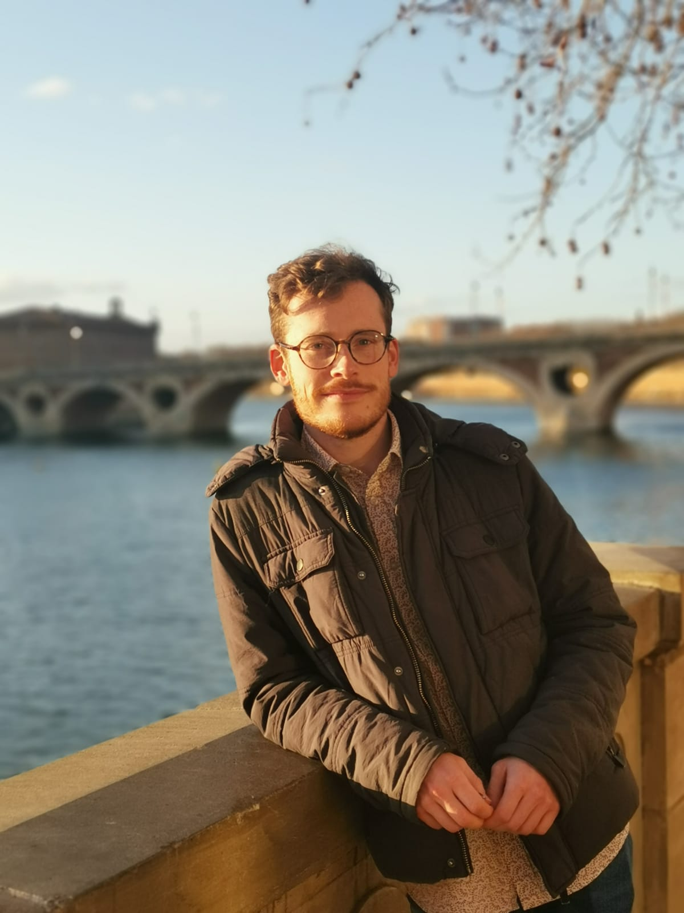

```{r setup_teaching, include=FALSE}
knitr::opts_chunk$set(echo = TRUE, cache = TRUE)
```


 </img>
  
  
Data Scientist with a master's degree in Applied Mathematics, Statistics, specialised in Biology and Ecology.

Junior Data Scientist in Ecology and Biology with strong skills in data processing and analysis, passionate about developing web applications and guides to share knowledge and communicate information. Experienced in GIS processing, R programming, and Git version control.

I am currently currently looking for a job in statistics and data engineering.
 
 
 </br>
 
  
## Contact information
<i class="fas fa-map-marker"></i>
<!-- Deep Sea Lab, UMR BEEP</br> -->
<!-- &nbsp;&nbsp;&nbsp;&nbsp; Ifremer Centre Bretagne, CS 10070</br> -->
&nbsp; 35000 Rennes, France</br>
  
<!-- <i class="fa fa-phone"></i> -->
<!-- See CV -->

<i class="fa fa-at"></i>
&nbsp; <a href="mailto:pierre.cottais@ifremer.fr">pierre [dot] cottais [at] ifremer [dot] fr</a>


 